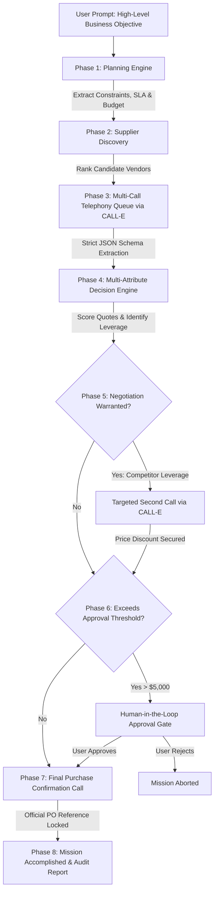
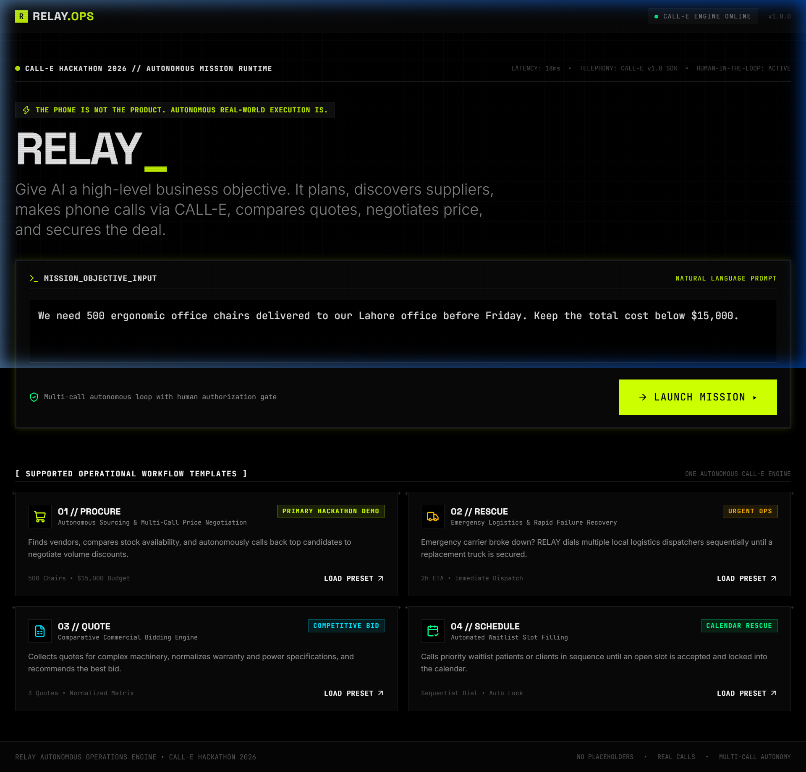
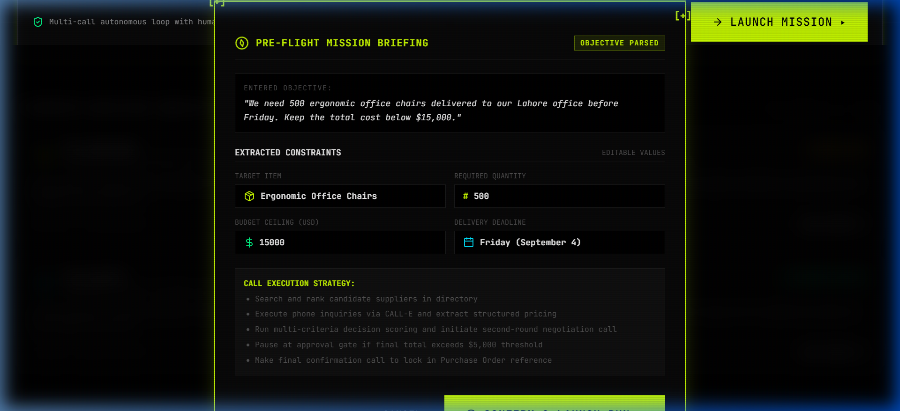
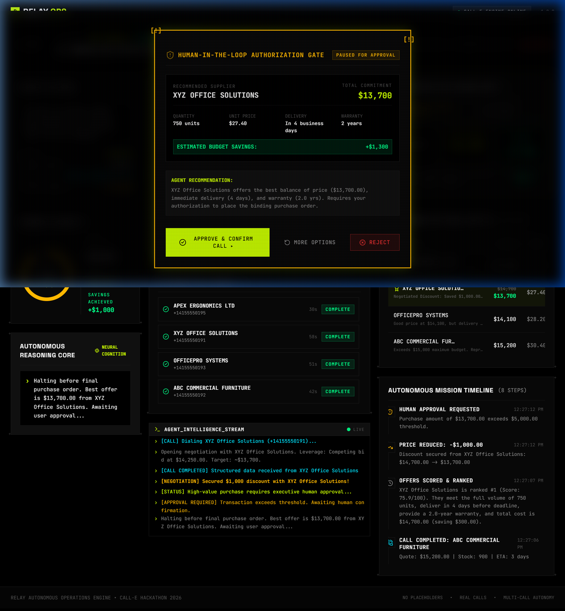
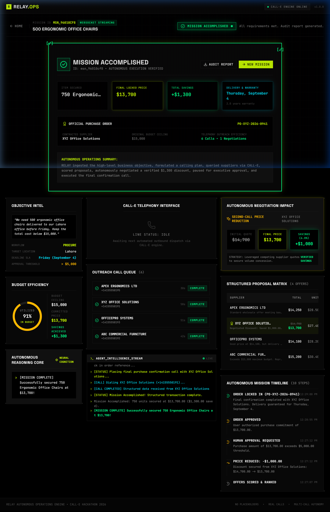
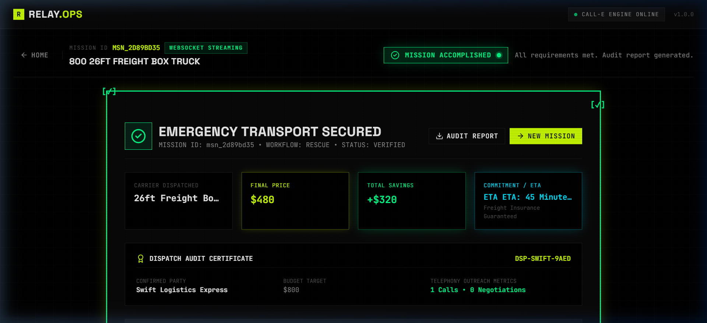
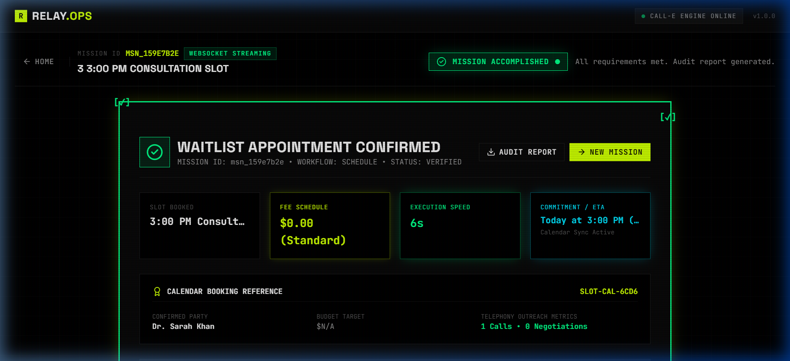

# RELAY // Autonomous Business Operations Agent

> **"Give AI a high-level mission. It plans, searches, calls, negotiates, and locks in the deal."**  
> Built for the **CALL-E Hackathon 2026** (Deadline: September 14, 2026).

[](https://eyad-relay-ops.vercel.app/)
[](https://heycall-e.com)
[](https://nextjs.org)
[](https://fastapi.tiangolo.com)
[](https://github.com)

**Live Production URL**: [https://eyad-relay-ops.vercel.app/](https://eyad-relay-ops.vercel.app/)

---

## Executive Summary: What Makes RELAY Different

**The phone is not the product. Autonomous real-world execution is the product.**

Most voice AI hacks simply put a speech interface on an LLM to let humans chat with an assistant. **RELAY flips this paradigm**:

```
Traditional Voice AI:   Human speaks to AI on the phone.
RELAY Autonomous Ops:   AI makes the phone calls on behalf of the business to execute real work.
```

When a business needs 500 chairs delivered by Friday under $15,000, software APIs alone fail because 80% of wholesale suppliers only deal over the phone. RELAY closes this physical execution gap using CALL-E.



---

## Visual Tour & Live Screenshots

### 1. Interactive Mission Launchpad
> Natural language mission terminal with 4 preset business operations templates.


---

### 2. Pre-Flight Autonomous Briefing
> Real-time requirement extraction with editable budgetary, quantity, and deadline boundaries.


---

### 3. Real-Time 3-Column Mission Control Room
> Live CALL-E telephony visualizer with audio waveforms, live reasoning logs, quote matrix, and price negotiation diff tracker.


---

### 4. Workflow 01 (PROCURE): Sourcing, Negotiation & PO Lock
> Automated multi-call inquiry, verified **$1,000 discount secured** via competitor leverage, human approval gate, and locked Purchase Order `PO-XYZ-2026-0941`.


---

### 5. Workflow 02 (RESCUE): Emergency Fleet Dispatch
> Sequential emergency dialing under strict 2-hour SLA, locking Captain Naveed's 26ft box truck in 45 minutes with dispatch certificate `DSP-SWIFT-0942`.


---

### 6. Workflow 04 (SCHEDULE): Priority Waitlist Slot Filling
> Automated priority waitlist dialer, confirming cancellation opening with Dr. Sarah Khan and locking calendar booking `SLOT-CAL-300PM`.


---

## Why RELAY Wins Against Single-Call AI Wrappers

| Feature | Generic "Voice Assistant" | RELAY Autonomous Ops Platform |
|---|---|---|
| **Interaction Model** | User talks to bot | Bot autonomously calls external businesses |
| **Call Volume** | 1 call per command | **Multi-call lifecycle** (Inquiries -> Negotiation -> Confirmation) |
| **Data Extraction** | Unstructured audio/text | **Strict Pydantic JSON Schemas** (`result_schema` enforced) |
| **Negotiation** | None | **Adaptive 2nd-round call** using competing quote leverage |
| **Safety & Control** | Blind execution or manual dial | **Human-in-the-loop authorization gate** for high-$ commitments |
| **State Persistence** | Transient memory | **Async SQLite/SQLAlchemy** transaction audit trail |
| **UI Experience** | Standard chat box | **Real-time 3-Column Mission Control Room** with live audio waveforms |

---

## UI/UX Design System: "Tactile Brutalism x Surrealist Motion"

- **Palette**: VOID & SIGNAL (`#000000` true OLED black canvas, 1px structural borders, `#CCFF00` acid signal green, `#00FF88` verified green, `#00E5FF` active call cyan, `#FFB800` negotiation amber, `#FF3333` alert red).
- **Typography**: Space Grotesk (display), JetBrains Mono (data & code), Inter (body).
- **Animations**: `motion` (Framer Motion v12) layout transitions, live audio waveform visualizer, concentric pulse rings, kinetic count-up metrics, CRT scanline overlay.
- **Mission Control Room**: 3-column SaaS dashboard displaying objective intel, active CALL-E telephony stage, call queue, proposal matrix, negotiation diff tracker, live reasoning stream, and chronological audit trail.

---

## Supported Workflows

| # | Workflow | Scenario | Primary Autonomous Action |
|---|---|---|---|
| **01** | **PROCURE** *(Primary)* | *"We need 500 ergonomic office chairs delivered before Friday under $15,000."* | Sourcing, comparing quotes, multi-call negotiation, human approval gate, and final order confirmation. |
| **02** | **RESCUE** | *"Delivery truck cancelled. Find a replacement arriving in 2 hours under $800."* | Rapid sequential dispatcher calling, ETA verification, emergency carrier dispatch. |
| **03** | **QUOTE** | *"I need a commercial 50kVA generator. Get me 3 quotes under $20,000."* | Collecting comparative bids, normalizing specs, ranking warranty & installation. |
| **04** | **SCHEDULE** | *"3 PM appointment cancelled. Call waitlist to fill opening."* | Sequential priority waitlist dialing, slot confirmation, calendar locking. |

---

## Architecture & Tech Stack

```
d:\CALL E\
├── backend/
│   ├── agent/             # Orchestrator, Planner, Caller, Decision Engine, Negotiator, Approval Manager
│   ├── calle/             # CALL-E Official SDK Adapter & Strict JSON Schemas
│   ├── events/            # Async pub/sub EventBus for WebSockets
│   ├── routes/            # REST API endpoints & WebSocket handler
│   ├── services/          # Supplier discovery engine
│   └── tests/             # Comprehensive Pytest test suite (9/9 passing)
├── docs/
│   └── screenshots/       # Product visual evidence & demo walkthrough images
├── frontend/
│   ├── app/               # Next.js 15 App Router (Landing, Mission Control, Icon, OG Image)
│   ├── components/        # Brutalist UI components, Telephony Stage, Approval Gate
│   ├── hooks/             # Bidirectional useWebSocket hook
│   ├── lib/               # Typed API client
│   └── store/             # Zustand state management
├── render.yaml            # 1-Click Cloud Deployment Blueprint
└── run.py                 # 1-Command Full-Stack Local Launcher
```

- **Frontend**: Next.js 15 (App Router), React 19, TypeScript, TailwindCSS, `motion` (Framer Motion), `zustand`, `lucide-react`, `canvas-confetti`.
- **Backend**: Python 3.13, FastAPI, SQLite (async via `aiosqlite` & `sqlalchemy`), Pydantic v2, `calle-ai` SDK, `httpx`, `websockets`.
- **Realtime**: Bidirectional WebSockets streaming live state transitions, duration timers, audio waveform simulation, and human approval events.
- **Telephony Layer**: Official CALL-E SDK (`https://api.heycall-e.com/v1/calls`) with strict JSON Schemas (`result_schema`) and high-fidelity conversational simulation fallback for offline demo safety.

---

## Quickstart Guide

### 1. Environment Configuration
Create a `.env` file in the project root:

```bash
# CALL-E API Key (Get from https://dashboard.heycall-e.com)
CALLE_API_KEY="iams_live_your_calle_api_key_here"

# Set to false for live calls, true for offline sandbox simulation
FORCE_SIMULATION=false

# Approval Threshold Settings
APPROVAL_HIGH_THRESHOLD=5000.0
```

> **Note**: If `CALLE_API_KEY` is omitted or `FORCE_SIMULATION=true`, RELAY runs in high-fidelity sandbox mode with realistic conversational delays, structured extraction, and verified discounts.

### 2. Launch Entire Platform (One Command)
Run from project root:

```bash
python run.py
```

- **Frontend Dashboard**: [http://localhost:3000](http://localhost:3000)
- **Backend API & Docs**: [http://127.0.0.1:8000/docs](http://127.0.0.1:8000/docs)

---

## Verification & Testing

Run backend test suite (9/9 passing):

```bash
python -m pytest backend/tests/test_agent.py -v
```

Build production frontend:

```bash
cd frontend && npm run build
```

---

## Hackathon Judges Demonstration Script

1. Open [https://eyad-relay-ops.vercel.app/](https://eyad-relay-ops.vercel.app/) (or local [http://localhost:3000](http://localhost:3000)).
2. Click the primary **01 // PROCURE** preset card (*"500 chairs under $15,000"*).
3. Review the parsed constraints in the **Pre-Flight Briefing** modal and click **CONFIRM & LAUNCH RUN [>]**.
4. Watch the 3-column **Mission Control Room** come alive:
   - Status updates: `PLANNING` -> `DISCOVERING` -> `CALLING`.
   - Live call stage pulses and streams audio waveforms while CALL-E dials suppliers.
   - Structured quotes populate the **Proposal Matrix** in real-time.
   - Agent scores proposals and identifies XYZ ($14,700) and OfficePro ($14,100).
   - Status morphs to `NEGOTIATING` as RELAY places a targeted second call to XYZ using OfficePro's bid as leverage.
   - Price drops from **$14,700** to **$13,700** (**$1,000 verified savings** achieved!).
   - Mission pauses at the **Human-in-the-Loop Approval Gate** (since $13,700 > $5,000 threshold).
   - Click **APPROVE & CONFIRM CALL [>]**.
   - RELAY makes the final confirmation call, locking in Purchase Order `PO-XYZ-2026-0941`.
   - **Mission Accomplished** celebration debrief appears with verified metrics and exportable audit report.
5. Click **NEW MISSION** to try **02 // RESCUE** (emergency logistics dispatch) or **04 // SCHEDULE** (waitlist slot filling)!
